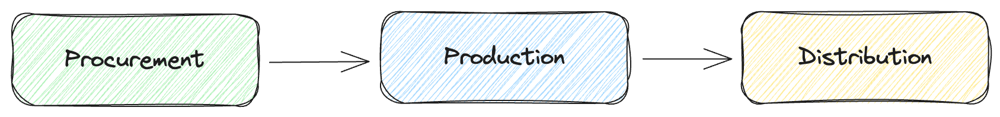
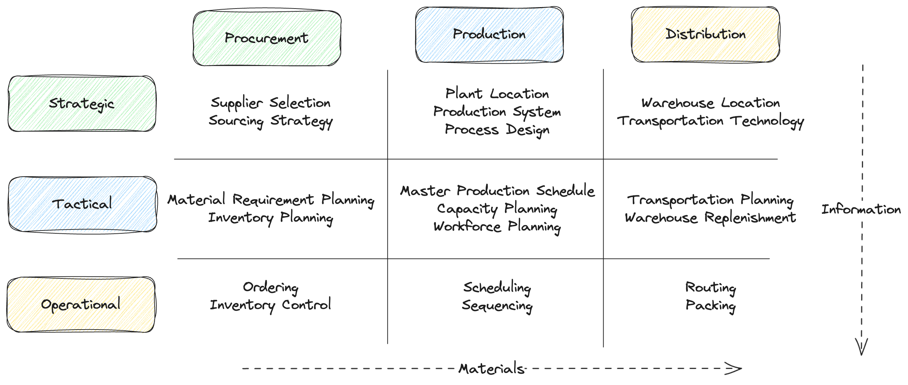

# Supply Chain Optimization

## Decisions

In the complex landscape of organizational decision-making, clarity and precision are paramount. Understanding the hierarchy of decisions within an organization is essential for effective strategic planning and operational execution. 

### Strategic

Strategic decisions are high-level decisions made by senior management that set the overall direction and objectives of the organization. They are typically long-term decisions that shape the organization's competitive position and future course of action. Strategic decisions focus on the organization as a whole, including its mission, vision, goals, and competitive positioning in the marketplace. Examples of strategic decisions include market selection, product diversification, mergers and acquisitions, entry into new markets, investment in new technologies, and long-term resource allocation.

### Tactical

Tactical decisions are medium-term decisions made by middle management or functional managers to implement the strategic decisions and achieve the organization's objectives. They bridge the gap between strategic planning and day-to-day operations. Tactical decisions focus on translating strategic objectives into specific plans, actions, and resource allocations to achieve short to medium-term goals. Examples of tactical decisions include production planning, inventory management, workforce scheduling, supplier selection, pricing strategies, marketing campaigns, and budget allocations for specific projects or initiatives.

### Operational

Operational decisions are low-level decisions made by front-line managers or operational staff to execute the day-to-day activities of the organization. They are short-term decisions that directly impact the immediate functioning of the organization. Operational decisions focus on the routine tasks and processes required to deliver products or services to customers, manage resources, and maintain operational efficiency. Examples of operational decisions include order processing, inventory replenishment, scheduling production runs, routing deliveries, managing customer inquiries, resolving quality issues, and maintaining equipment.

## Supply Chain

Navigating the intricacies of supply chain management requires a comprehensive understanding of its foundational components. The three main pillars of a supply chain are procurement, production, and distribution. Each component represents a crucial stage in the journey of goods and services from conception to the hands of end-users.

### Procurement

Procurement involves the acquisition of goods, services, or raw materials needed for the production process. It encompasses activities such as sourcing suppliers, negotiating contracts, and ensuring the timely delivery of materials. The focus of procurement is to secure high-quality inputs at optimal costs, fostering supplier relationships, and mitigating risks associated with the supply of essential resources. Procurement decisions may include selecting suppliers based on cost-effectiveness, negotiating favorable terms, and establishing long-term partnerships to ensure a stable supply chain.

### Production

Production refers to the transformation of raw materials or inputs into finished goods or services. It involves manufacturing processes, quality control, and the utilization of resources to create marketable products. The focus of production is on efficiency, quality control, and meeting production targets to fulfill customer demand. It includes optimizing manufacturing processes and managing resources effectively. Production decisions may involve choosing manufacturing methods, setting production schedules, and implementing quality assurance measures to ensure the delivery of high-quality products.

### Distribution

Distribution encompasses the activities involved in delivering finished goods from the production facility to end customers. It involves logistics, transportation, warehousing, and order fulfillment. The focus of distribution is on timely and cost-effective delivery, optimizing transportation routes, managing inventory, and ensuring products reach customers in optimal condition. Distribution decisions may include choosing distribution channels, selecting transportation modes, and implementing inventory management systems to streamline the flow of products to consumers.

## Supply Chain Management

### Strategic Decisions in Supply Chain

At the strategic level, organizations make decisions regarding long-term supplier relationships, strategic sourcing initiatives, and global procurement strategies. This involves identifying key suppliers, negotiating contracts, and establishing alliances to ensure a stable and cost-effective supply chain.

Strategic decisions in production focus on long-term capacity planning, technology investments, and product portfolio management. Organizations decide on the location of manufacturing facilities, automation strategies, and outsourcing opportunities to optimize production processes and maintain competitive advantage.

Strategic decisions in distribution involve designing the optimal distribution network to meet customer demands efficiently. This includes decisions on warehouse locations, transportation modes, and distribution channel strategies to minimize costs and maximize service levels.

- Supply Chain Network Design
- Transportation Mode Selection
- Supplier/Vendor Selection
- Labor Strategy Optimization
- Capacity Planning
- Product Portfolio Optimization
- Demand Planning
- Yield and Revenue Management

### Tactical Decisions in Supply Chain

Tactical decisions in procurement revolve around inventory management, supplier performance monitoring, and order quantity optimization. Organizations determine reorder points, safety stock levels, and procurement schedules to balance inventory costs with service levels.

Tactical decisions in production focus on short to medium-term production scheduling, workforce allocation, and inventory control. This includes planning production runs, scheduling machine maintenance, and managing work-in-progress inventory to meet demand fluctuations efficiently.

Tactical decisions in distribution include route optimization, order batching, and warehouse layout design. Organizations plan delivery schedules, consolidate shipments, and allocate resources to minimize transportation costs and improve delivery speed.

- Inventory Optimization
- Inventory Positioning
- Safety Stock Optimization
- Maintenance Planning
- Production Planning
- Supply Planning
- Sales & Operations Planning
- Workforce/Shift Planning
- Replenishment Planning
- Demand Sensing/Forecasting/Planning

### Operational Decisions in Supply Chain

Operational decisions in procurement involve day-to-day activities such as order processing, supplier inquiries, and invoice processing. Organizations execute purchase orders, resolve supplier issues, and track supplier performance to ensure smooth procurement operations.

Operational decisions in production focus on real-time monitoring of production processes, quality control, and resource utilization. Organizations adjust production schedules, address equipment breakdowns, and implement corrective actions to meet production targets and maintain product quality.

Operational decisions in distribution include order picking, packing, and shipping operations. Organizations manage warehouse operations, coordinate transportation activities, and track shipments to ensure timely and accurate delivery to customers.

- Vehicle Routing
- Workforce Scheduling/Rostering
- Resource Allocation/Utilization
- Project and Machine Scheduling
- Logistics/Shipment Planning and Routing
- Job Shop Production Scheduling
- Flow Shop Scheduling
- Machine and Equipment Planning
- Order Fulfillment Planning

## Mathematical Optimization in Supply Chain

Every mathematical optimization model consists of two fundamental parts: the objective function, subject to minimization or maximization, and the constraint matrix, which consists of different inequalities and restricts the solution space.

In the case of cost-based supply chain models, all costs arising such as transportation costs, production costs, non-delivery costs constitute the objective function, which must then be minimized.
Costs are usually connected to the variables that the client is interested in knowing: how many products should be transported by what means of transport, or how many products should be produced in this particular factory.

The structure of the supply chain itself presents numerous limitations. These arise from constraints introduced by the client such as limited resource capacities, but also from essential requirements such as consistency in inventory balancing.
Supply chain optimization aims to minimize business-related costs incurred by inventory maintenance, production, transportation, or demand fulfillment failure. Additionally, it takes into account the scarcity of resources required by production and transportation activities.

The basic decisions of the supply chain model that must be made are the quantities of material acquisition, production, transportation, demand fulfillment, inventory maintenance, and resource capacity utilization. In other words, the optimization model decides how many of the products to produce, store, and transport between locations.

Problems are commonly classified based on their impact within different planning horizons. In this way, problems related to strategic decisions, tactical decisions, and operational decisions can be differentiated.

## Strategic Decisions

Related to the design and configuration of supply chains. They usually have a significant economic impact in the long term. Problems associated with the location and sizing of facilities such as plants and distribution centers can be modeled using mathematical programming.

- Facility Location: seeks to find the optimal location for suppliers, production plants, warehouses, and distribution centers by minimizing the costs of the various agents involved.

## Tactical Decisions

Related to the company's activities in the medium term such as which markets to supply, production plans, inventory and human resources policies, demand planning, work shifts, scheduled maintenance, purchasing planning, among others. The supply chain is already designed, and the aim is to optimize resource usage and the supply network.

- Aggregate Planning: seeks the optimal level of workforce in each period, as well as the optimal level of production and inventory in each of the periods.
- Workforce Scheduling: aims to minimize the number of workers required for each shift in the area or department under study, while meeting system constraints.
- Supplier Selection: aims to select suppliers responsible for supplying raw materials, parts, or intermediate products for production in a planning period.

## Operational Decisions

Related to the shortest planning horizon focusing primarily on fulfilling customer orders at minimum cost.

- Batch Size: seeks to minimize the costs of meeting demand (or not), inventory holding costs, and production costs in each period of the planning horizon.
- Operations Scheduling: aims to define the sequencing of a set of activities in order to perform them in the shortest possible time, to maximize resource utilization, minimize downtime, waste, etc.
- Product Mix: aims to maximize profits by determining the optimal quantity to produce of each of the products manufactured, taking into account capacity constraints, market constraints, resource constraints, etc.

## Examples

- https://github.com/Gurobi/modeling-examples/tree/master?tab=readme-ov-file

- https://github.com/Gurobi/modeling-examples/blob/master/facility_location/facility_location.ipynb
- https://github.com/Gurobi/modeling-examples/blob/master/market_sharing/market_sharing.ipynb
- https://github.com/Gurobi/modeling-examples/blob/master/customer_assignment/customer_assignment.ipynb
- https://github.com/Gurobi/modeling-examples/blob/master/factory_planning/factory_planning_2.ipynb
- https://github.com/Gurobi/modeling-examples/blob/master/food_manufacturing/food_manufacture_2.ipynb
- https://github.com/Gurobi/modeling-examples/blob/master/technician_routing_scheduling/technician_routing_scheduling.ipynb
- https://github.com/Gurobi/modeling-examples/blob/master/manpower_planning/manpower_planning.ipynb
- https://github.com/Gurobi/modeling-examples/blob/master/traveling_salesman/tsp.ipynb
- https://github.com/Gurobi/modeling-examples/blob/master/mining/mining.ipynb
- https://github.com/Gurobi/modeling-examples/blob/master/car_rental/car_rental_2.ipynb
- https://github.com/Gurobi/modeling-examples/blob/master/economic_planning/economic_planning.ipynb
- https://github.com/Gurobi/modeling-examples/blob/master/efficiency_analysis/efficiency_analysis.ipynb
- https://github.com/Gurobi/modeling-examples/blob/master/electrical_power_generation/electrical_power_2.ipynb

### Facility Location Problem:
  
Facility location problems can be commonly found in many industries, including logistics and telecommunications. In this example, we'll show you how to tackle a facility location problem that involves determining the number and location of warehouses that are needed to supply a group of supermarkets.

### Market Sharing Problem

In this example, we’ll show you how to solve a goal programming problem that involves allocating the retailers to two divisions of a company in order to optimize the trade-offs of several market sharing goals.

### Supply Chain Design Problem

Given a set of factories, depots, and customers, the goal of this example is to determine which depots to open in order to minimize overall costs. Besides, this model allows the possibility to close some depots and open new ones

### Customer Assignment Problem

Select the location of facilities based on their proximity to customers.

### Factory Planning

In this example you will learn how to create an optimal production plan that will not only maximize profits, but also determine which month in which to perform maintenance operations on your machines.

### Blending Problem

This model is an example of a blending problem. In blending optimization problems, multiple raw materials are combined in a way the meets the stated constraints for the lowest cost.

### Technician Routing and Scheduling Problem

This is a model example to discover how mathematical optimization can help telecommunications firms automate and improve their technician assignment, scheduling, and routing decisions in order to ensure the highest levels of customer satisfaction.

### Manpower Planning

Staffing problems – which require difficult decisions about the recruitment, training, layoffs, and scheduling of workers – are common across a broad range of manufacturing and service industries. In this example, you’ll learn how to model and solve a complex staffing problem by creating an optimal multi-period operation plan that minimizes the total number of layoffs and costs.

### Traveling Salesman Problem

In this example, you’ll learn how to tackle one of the most famous combinatorial optimization problems in existence: the Traveling Salesman Problem (TSP). The goal of the TSP – to find the shortest possible route that visits each city once and returns to the original city – is simple, but solving the problem is a complex and challenging endeavor.
